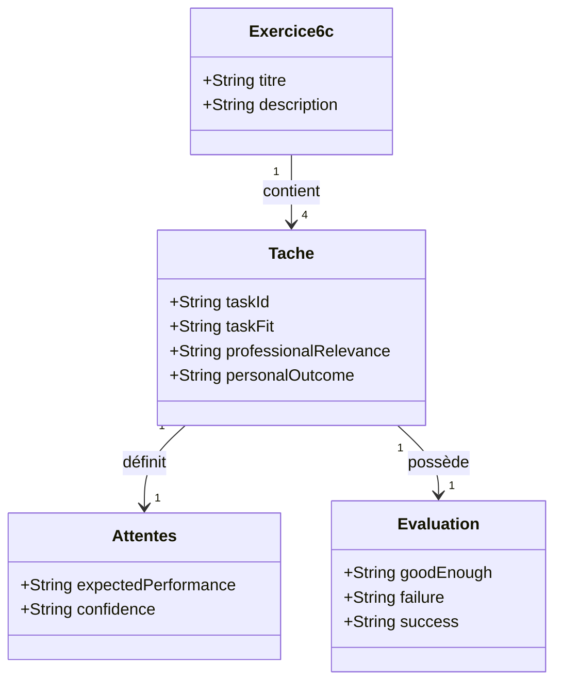

# Diagramme de classes – Exercice 6.c

Ce diagramme représente les données nécessaires pour gérer l'exercice 6.c « What's on the Line? ».

```mermaid
classDiagram

class Exercice6c {
    +String titre
    +String description
}

class Tache {
    +String taskId
    +String taskFit
    +String professionalRelevance
    +String personalOutcome
}

class Attentes {
    +String expectedPerformance
    +String confidence
}

class Evaluation {
    +String goodEnough
    +String failure
    +String success
}

Exercice6c "1" --> "4" Tache : contient
Tache "1" --> "1" Attentes : définit
Tache "1" --> "1" Evaluation : possède
```
